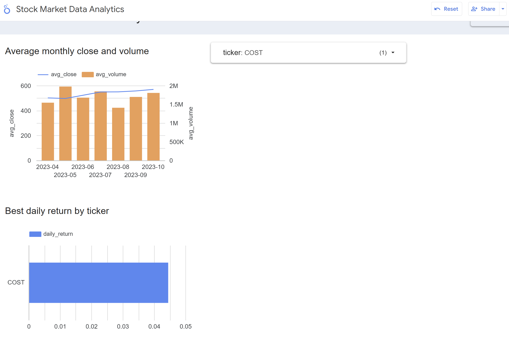

# 📊 Data Engineering project on Stock Market Data

## 🧠 Goal

Build a data engineering pipeline that ingests stock market data, performs analytics, and stores results in BigQuery. The pipeline is modular and easily extendable to include more sources and advanced analytics.

---

## 🔧 Technologies Used

- 🐳 Docker for containerization  
- ☁️ Google Cloud Platform (GCS, BigQuery)  
- ⚙️ Terraform for Infrastructure as Code  
- 🛠️ Apache Airflow for orchestration  
- ⚡ Apache Spark for analytics  

---

## ✅ Prerequisites

### 1. Google Cloud Setup

- Create a GCP project and note the **Project ID**.
- Create a **Service Account** and assign the following roles:
  - Storage Admin
  - Storage Object Admin
  - Viewer
  - BigQuery Admin
- Download the service account key JSON:
  - Save as:
    - `./gcp-service-account.json` (for Airflow)
    - `./spark/gcp/gcp-service-account.json` (for Spark)
- Update the following files with your Project ID and credentials:
  - `terraform/variables.tf`
  - `spark/app/stock_analytics.py` → Update `BQ_PROJECT`

### 2. Polygon.io API Key

- Used to fetch stock market data.
- A demo API key is included (limited to free-tier usage and will be deactivated in the future).
- You can get your own free key here: [https://polygon.io/pricing](https://polygon.io/pricing)
- Update the key in `dags/fetch_stock_data.py`.

> **Note:** We use a shortened list of S&P 500 tickers to avoid taking too long and comply with the free-tier rate limits. You can find this CSV under `dags/resources/sp500_tickers.csv`.

---

## 🚀 Project Setup

### 1. Deploy GCP Infrastructure with Terraform

```bash
cd terraform
terraform init
terraform apply -var="project_id=your-gcp-project-id" -var="region=us-central1"
```

To clean up resources later:

```bash
terraform destroy
```

### 2. Ingest Data to GCS with Airflow

From the project root:

```bash
docker-compose up --build
```

- Access Airflow at: [http://localhost:8080](http://localhost:8080)  
  Login: `airflow` / `airflow`
- Trigger the DAG `fetch_sp500_data` to download data and store Parquet files in GCS.

Once complete:

```bash
docker-compose down
```

### 3. Run Spark Analytics and Save to BigQuery

From the `spark` directory:

```bash
docker-compose up
```

- This job reads Parquet files from GCS, performs monthly aggregates and return analysis, and stores results in BigQuery.

---

### 4. Dashboard

A simple dashboard was created using **Google Looker Studio**, connected directly to the BigQuery tables generated in the analytics step. It includes:

- Average monthly closing price and volume (per stock)
- Best and worst return days (per stock)

You can view the dashboard here:  
📊 [Looker Studio Report](https://lookerstudio.google.com/reporting/2ad4cf58-09cd-4db1-be3b-71231c12bbcc)

> _Note: The screenshot below is included for reference in case the report link becomes inactive after the free trial period._





## 🗂️ Project Structure

```
DEproject/
├── gcp-service-account.json
├── docker-compose.yaml
├── Dockerfile
├── README.md
├── terraform/
│   ├── main.tf
│   └── variables.tf
├── dags/
│   ├── fetch_stock_data.py
│   └── resources/
│       └── sp500_tickers.csv
├── spark/
│   ├── docker-compose.yaml
│   ├── Dockerfile
│   ├── requirements.txt
│   ├── app/
│   │   └── stock_analytics.py
│   └── gcp/
│       └── gcp-service-account.json
```

---